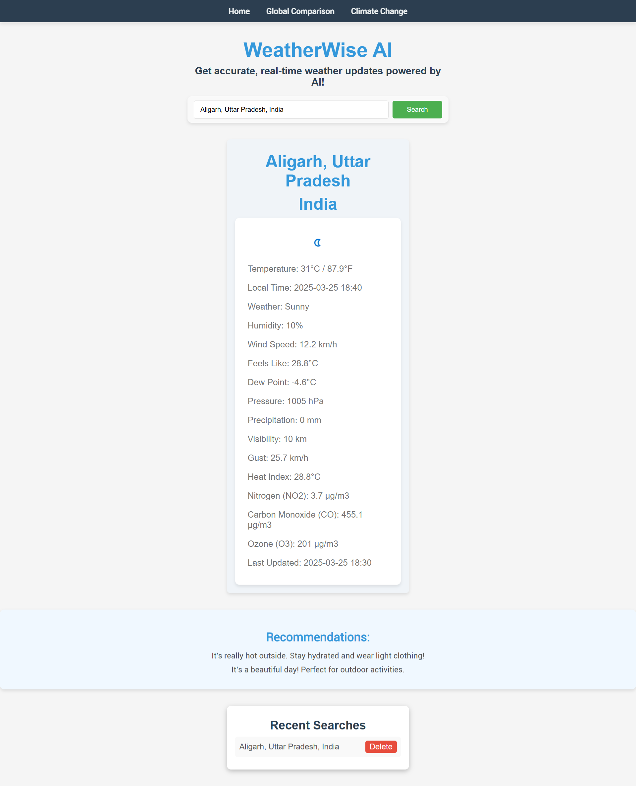
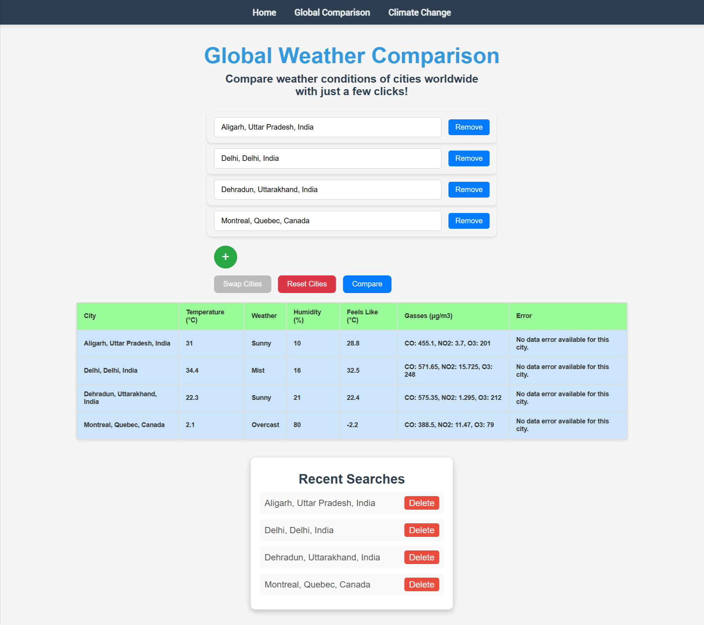
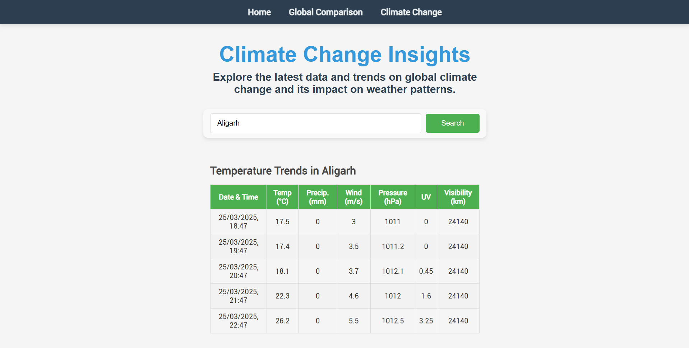

# WeatherWise AI

<div align="center">
  
</div>

**WeatherWise AI** is a modern, full-featured weather application that delivers real-time weather updates and personalized recommendations using cutting-edge web technologies. Built with React and Vite on the frontend and leveraging secure serverless functions on Vercel, this project demonstrates a strong grasp of modern web development, API integration, and scalable architecture.

---

## Table of Contents

- [Overview](#overview)
- [Project Demo Images](#project-demo-images)
- [Features](#features)
- [Technical Highlights](#technical-highlights)
- [Architecture & Design](#architecture--design)
- [Challenges & Solutions](#challenges--solutions)
- [Getting Started](#getting-started)
- [Environment Variables](#environment-variables)
- [Deployment](#deployment)
- [Future Enhancements](#future-enhancements)
- [Contributing](#contributing)
- [License](#license)
- [Live Demo](#live-demo)

---

## Overview

WeatherWise AI provides accurate and real-time weather information for any city worldwide. Users can search for locations, view detailed weather metrics (temperature, humidity, wind speed, air quality, and more), and even see recent search history. By using serverless functions to fetch data securely, the app ensures that sensitive API keys remain hidden and minimizes CORS issues—an approach that highlights best practices in secure API integration and modern deployment.

---

## Project Demo Images

<table>
  <tr>
    <td align="center">
      
      <br><sub>Demo Image 1</sub>
    </td>
    <td align="center">
      
      <br><sub>Demo Image 2</sub>
    </td>
    <td align="center">
      
      <br><sub>Demo Image 3</sub>
    </td>
  </tr>
</table>

---

## Features

- **City Search & Suggestions:** Quickly find weather data for any city with real-time search suggestions.
- **Detailed Weather Display:** View comprehensive weather metrics including temperature (°C/°F), humidity, wind speed, local time, and air quality.
- **Recent Searches:** Automatically store and display your last five searched cities.
- **Serverless API Integration:** Utilize Vercel serverless functions to securely fetch weather data without exposing API keys.
- **Responsive & Modern UI:** A clean, intuitive design built with React and CSS that performs seamlessly on both desktop and mobile devices.
- **Continuous Deployment:** Leveraging Vercel's deployment platform for automatic builds and updates.

---

## Technical Highlights

This project is a showcase of modern web development techniques and technical acumen:

- **React & Vite:** Fast, efficient, and modern frontend development.
- **Serverless Architecture:** Secure data fetching using Vercel's serverless functions, which abstracts backend logic and protects sensitive credentials.
- **API Integration:** Seamless consumption of WeatherAPI for real-time weather data.
- **Environment Variable Management:** Use of environment variables to manage API keys both locally (via a `.env` file) and in production (via Vercel's Dashboard).
- **Responsive Design & UI/UX:** Custom CSS for a responsive and user-friendly interface.
- **Robust Error Handling:** Comprehensive error management and user feedback throughout the application.
- **Version Control & Continuous Deployment:** Git for version control and Vercel for automated deployments, ensuring rapid iteration and continuous improvement.

---

## Architecture & Design

**WeatherWise AI** is designed with a clear separation of concerns:

- **Frontend:** Built with React and Vite, the user interface is organized into modular components (SearchBar, WeatherDisplay, etc.), promoting reusability and maintainability.
- **Backend (Serverless Functions):** API calls are handled by Vercel serverless functions (e.g., `fetchWeather.js`), ensuring that sensitive API keys are not exposed to the client and that CORS issues are mitigated.
- **Data Flow:** The client communicates with the serverless functions which, in turn, interface with external APIs (WeatherAPI). This layered approach enhances security and scalability.

---

## Challenges & Solutions

During development, several challenges were addressed:

- **API Key Exposure & Security:**  
  _Challenge:_ Directly calling external APIs from the client exposed sensitive API keys.  
  _Solution:_ Implemented serverless functions on Vercel to act as a proxy, securely fetching data and keeping API keys hidden.

- **CORS Issues:**  
  _Challenge:_ Client-side API calls often run into CORS restrictions.  
  _Solution:_ Using serverless functions effectively bypasses these issues by handling API requests on the server side.

- **Performance Optimization:**  
  _Challenge:_ Ensuring the app remained responsive even with real-time data updates.  
  _Solution:_ Employed React best practices, efficient state management, and asynchronous API calls.

- **Responsive UI Design:**  
  _Challenge:_ Designing a user interface that works well on both desktop and mobile devices.  
  _Solution:_ Developed a custom CSS layout and rigorously tested across various screen sizes.

---

## Getting Started

### Prerequisites

- [Node.js](https://nodejs.org/) (v14 or above)
- npm or yarn

### Installation

1. **Clone the repository:**

   ```bash
   git clone https://github.com/prashantsaini1525/WeatherWise-AI.git
   cd weatherwise-app

   ```

2. **Install dependencies:**

   ```bash
   npm install

   # or

   yarn install

   ```

3. **Set Up Environment Variables:**

- Create a `.env` file in the root directory and add:

  ```bash
  VITE_API_KEY=your_weatherapi_key

  ```

- **Note:** For production, set these variables in the Vercel Dashboard under Project Settings → Environment Variables.

4. **Run the App Locally:**

   ```bash
   npm run dev

   ```

   - Visit http://localhost:3000 in your browser.

---

# Environment Variables

To run WeatherWise AI successfully, you'll need to configure the following environment variables:

## VITE_API_KEY

Your WeatherAPI key is required for fetching weather data. For local development, create a `.env` file in the project root and add:

```bash
VITE_API_KEY=your_weatherapi_key
```

For production deployments (e.g., on Vercel), set these environment variables in the platform’s dashboard under the project settings.

---

# Deployment

WeatherWise AI is optimized for deployment with Vercel. Follow these steps to deploy:

## Connect Your Repository

- **Sign in to your [Vercel account](https://vercel.com/).**
- **Import your WeatherWise AI repository from GitHub.**
- **Vercel will auto-detect the Vite (React) configuration.**

## Configure Environment Variables

- **Navigate to your project settings in the Vercel Dashboard.**
- **Add the required environment variables (e.g., `VITE_API_KEY`).**

## Automatic Deployments

- **Every push to your connected branch triggers a new deployment.**
- **Once deployed, access your app via the URL provided by Vercel.**

# Future Enhancements

WeatherWise AI is a work in progress with plans for continuous improvement. Future enhancements include:

- **Advanced Forecasting:**  
  Integrate extended forecasts and historical weather data for more in-depth insights.

- **User Personalization:**  
  Implement user accounts to save favorite locations and enable custom weather notifications.

- **UI/UX Improvements:**  
  Enhance the interface with features like dark mode and additional accessibility options.

- **Performance Optimization:**  
  Refine data fetching and state management to boost performance further.

- **Multi-language Support:**  
  Add internationalization to make the app accessible to a global audience.

---

# Contributing

Contributions are welcome! If you’d like to help improve WeatherWise AI, please follow these steps:

## Fork the Repository

- Create your own fork of the project on GitHub.

## Create a Feature Branch

```bash
git checkout -b feature/your-feature-name
```

## Commit Your Changes

- Write clear, concise commit messages.

## Push Your Branch

```bash
git push origin feature/your-feature-name
```

## Open a Pull Request:

- Provide a detailed description of your changes and submit a PR for review.

# License

WeatherWise AI is open source and distributed under the MIT License.  
For more details, please see the [LICENSE](./LICENSE) file.

---

# Live Demo

Experience WeatherWise AI in action at:  
[WeatherWise AI Live Demo](https://weather-wise-ai.vercel.app/)

> **Note:** Replace the demo URL with your actual deployed application's link.
